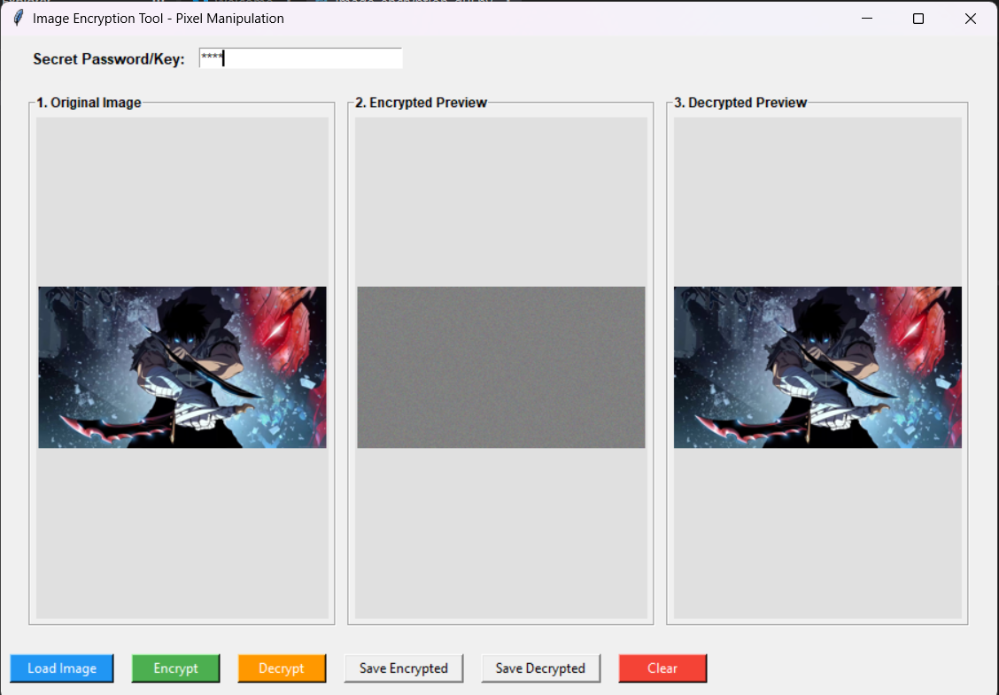

# Image Encryption Tool - Pixel Manipulation

## Task 02 - Prodigy InfoTech Cyber Security Internship

A Python-based GUI application that encrypts and decrypts images using pixel-level manipulation techniques.

The application uses a password-derived key to perform a byte-level XOR transformation and key-based pixel shuffling. Users can load an image, encrypt it, preview the encrypted result, decrypt it using the same key, and save both encrypted and decrypted images.

## Features

- Load PNG, JPG, JPEG, and BMP images
- Password/key-based image encryption
- Pixel-level XOR transformation
- Key-based pixel shuffling
- Encrypted image preview
- Decrypted image preview
- Decrypt images using the same password/key
- Save encrypted images as PNG
- Save decrypted images as PNG or JPG
- Clear the current session
- Simple graphical user interface
- Input validation and error handling

## Technologies Used

- Python
- Tkinter
- Pillow (PIL)
- hashlib
- random

## How It Works

The application uses the entered password/key to generate a deterministic encryption sequence.

### 1. Key Generation

The entered password is processed using SHA-256 to generate a deterministic seed.

```text
Password
    ↓
SHA-256
    ↓
Seed
```

### 2. XOR Transformation

The image is converted into RGB byte data.

A pseudo-random byte stream is generated from the key and XORed with the image bytes.

```text
Original Image Bytes
        +
Key-generated XOR Stream
        ↓
XOR Operation
        ↓
Transformed Image Bytes
```

### 3. Pixel Shuffling

The image pixels are shuffled using a key-based Fisher-Yates permutation.

This changes the position of the pixels, making the encrypted image visually scrambled.

```text
Original Pixels
      ↓
Key-based Pixel Shuffle
      ↓
Scrambled Pixels
```

### 4. Decryption

The same password/key is used to regenerate the same XOR stream and pixel permutation.

The application first reverses the pixel shuffling and then applies the XOR operation again to recover the original image.

```text
Encrypted Image
      ↓
Reverse Pixel Shuffling
      ↓
Reverse XOR Transformation
      ↓
Decrypted Image
```

## How to Run

### 1. Install Python

Make sure Python 3.x is installed on your system.

### 2. Install Pillow

Open a terminal in the project folder and run:

```bash
pip install pillow
```

### 3. Run the Application

```bash
python image_encryption_gui.py
```

## How to Use

1. Enter a secret password/key.
2. Click **Load Image** and select an image.
3. Click **Encrypt**.
4. The encrypted image will appear in the **Encrypted Preview** panel.
5. Click **Decrypt** using the same password/key.
6. The decrypted image will appear in the **Decrypted Preview** panel.
7. Click **Save Encrypted** to save the encrypted image.
8. Click **Save Decrypted** to save the decrypted image.
9. Click **Clear** to reset the application.

## Screenshots

### Image Encryption and Decryption



The interface displays the original image, encrypted image, and decrypted image for comparison.

## Project Structure

```text
PRODIGY_CS_02/
│
├── image_encryption_gui.py
├── README.md
├── .gitignore
└── screenshot.png
```

## Task Information

**Internship:** Prodigy InfoTech Cyber Security Internship

**Task:** Task 02 - Pixel Manipulation for Image Encryption

**Objective:** Develop a simple image encryption tool using pixel manipulation techniques and allow users to encrypt and decrypt images.

## Note

This project is developed for educational and internship purposes to demonstrate image encryption and pixel manipulation concepts. It is not intended to replace standardized cryptographic algorithms used in production security systems.
